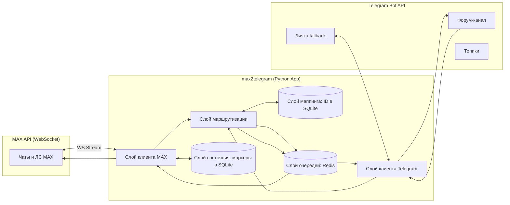

# Техническая спецификация: max2telegram (v3.2)

## 1. Назначение продукта

**max2telegram** — асинхронный сервис-мост для двусторонней синхронизации переписки между мессенджером **MAX** и **Telegram**. Сторона Telegram представлена **одним Форум-каналом** с множеством тематических топиков. 

Сервис использует **WebSocket-подключение** к API MAX для мгновенного получения событий и хранит **маркеры (курсоры) последнего обработанного сообщения** в базе данных. Это гарантирует, что ни одно сообщение не будет потеряно или обработано дважды во время перезапуска сервиса, сетевых сбоев или даунтайма. Вся маршрутизация выполняется **строго по идентификаторам**, а отправка в обе стороны регулируется асинхронными Redis-очередями для соблюдения лимитов API.

---

## 2. Участники и роли

| Участник | Роль в системе |
|----------|----------------|
| **Аккаунт MAX** | Источник и приёмник сообщений в MAX (групповые чаты и личные диалоги). |
| **Telegram-бот** | Администратор Форум-канала; создаёт топики, читает сообщения по `thread_id`, ставит реакции, выполняет команды. |
| **Доверенный оператор (fallback)** | Получает системные уведомления об ошибках очередей; выполняет управляющие команды. **В части пересылки сообщений имеет те же права, что и любой другой участник форума.** |
| **Участники форума Telegram** | Могут писать в любые маппированные топики; все их сообщения асинхронно пересылаются в MAX. |
| **Оператор инфраструктуры** | Настраивает Docker Compose, управляет переменными окружения, уровнем логирования и контролирует логи. |

---

## 3. Архитектура и потоки данных

### 3.1. Общая схема


### 3.2. Поток «MAX → Telegram» (с маркерами и очередью)
1. `Слой клиента MAX` подключается по WebSocket, запрашивает последние маркеры из `Слоя состояния`.
2. При получении нового события:
   - **Дедупликация:** если `message_id` <= `last_message_id`, событие игнорируется.
   - `Слой маршрутизации` проверяет маппинг в `Слое маппинга`. Если нет – запрашивает у `Слоя клиента Telegram` создание топика, сохраняет маппинг.
   - Задача сериализуется и передается в `Слой очередей` (`max2tg_queue`).
   - **Маркер** атомарно обновляется в `Слое состояния`.
3. `Слой клиента Telegram` (Воркер) забирает задачу, соблюдает лимит (≥ 3.5 сек), отправляет сообщение и сохраняет связь `max_message_id` ↔ `tg_message_id` в БД.

### 3.3. Поток «Telegram → MAX» (с очередью)
1. `Слой клиента Telegram` получает сообщение из топика (`tg_chat_id` + `message_thread_id`). Игнорирует сообщения бота.
2. `Слой маршрутизации` ищет пару `{tg_chat_id, message_thread_id}` в `Слое маппинга`.
3. Если найдено: задача передается в `Слой очередей` (`tg2max_queue`). Если нет: игнорируется.
4. `Слой клиента MAX` (Воркер) забирает задачу, ждет настраиваемого лимита, отправляет сообщение в MAX.
5. **Только после успеха от API MAX**, `Слой клиента Telegram` ставит реакцию 🦄 на исходное сообщение.

---

## 4. Технические требования и стек технологий

### 4.1. Стек разработки
| Компонент | Технология | Обоснование / Требования |
|-----------|------------|--------------------------|
| **Язык** | Python 3.10+ | Нативная поддержка `asyncio`, строгая типизация (type hints). |
| **Клиент MAX** | `PyMAX` | **Обязательная поддержка WebSocket** для стриминга событий. Должен поддерживать переподключение и запрос истории по курсору/ID. |
| **Клиент Telegram** | `aiogram 3.x` | Предпочтительно для Bot API (работа с форумами, очередями, поллингом/вебхуками). |
| **База данных** | SQLite | Хранение маппингов и маркеров состояния. **Обязательно**: режим `PRAGMA journal_mode=WAL` и `PRAGMA synchronous=NORMAL`. Библиотека: `aiosqlite` или `SQLAlchemy` (async). |
| **Очереди** | Redis | Хранение очередей `max2tg_queue` и `tg2max_queue`. Персистентность через `appendonly yes` (AOF). Библиотека: `redis-py` (async). |
| **Логирование** | `structlog` / `logging` | Структурированные JSON-логи. Уровень логирования настраивается через переменную окружения. |

### 4.2. Архитектура приложения (Python)
Приложение строится на базе `asyncio` и состоит из следующих независимых задач (tasks):
1. **MAX WebSocket Listener**: Поддерживает соединение, парсит события, управляет маркерами.
2. **Telegram Listener**: Aiogram Dispatcher.
3. **TG Worker**: Цикл `BLPOP` из `max2tg_queue` с `asyncio.sleep(3.5)`.
4. **MAX Worker**: Цикл `BLPOP` из `tg2max_queue` с настраиваемой задержкой.
5. **Admin Handler**: Обработчик команд только от `FALLBACK_USER_ID`.

### 4.3. Требования к развертыванию (Docker + Docker Compose)
Сервис поставляется в виде готового к запуску окружения. Папка `./data` монтируется для сохранения SQLite БД и сессии PyMAX между перезапусками.

```yaml
version: '3.8'
services:
  redis:
    image: redis:7-alpine
    restart: always
    volumes:
      - redis_data:/data
    command: redis-server --appendonly yes

  app:
    build: .
    restart: always
    depends_on:
      - redis
    environment:
      - MAX_TOKEN=${MAX_TOKEN}
      - MAX_DEVICE_ID=${MAX_DEVICE_ID}
      - TG_BOT_TOKEN=${TG_BOT_TOKEN}
      - TG_FORUM_CHANNEL_ID=${TG_FORUM_CHANNEL_ID}
      - FALLBACK_USER_ID=${FALLBACK_USER_ID}
      - DATABASE_URL=sqlite+aiosqlite:///app/data/bridge.db
      - REDIS_URL=redis://redis:6379/0
      - TG_RATE_LIMIT_DELAY_SEC=3.5
      - MAX_RATE_LIMIT_DELAY_SEC=1.0
      - MAX_RECONNECT_FETCH_LIMIT=50
      - LOG_LEVEL=INFO
    volumes:
      - ./data:/app/data
    logging:
      driver: "json-file"
      options:
        max-size: "10m"
        max-file: "3"

volumes:
  redis_data:
```

### 4.4. Архитектурные принципы и стандарты разработки
Проект обязан строго следовать следующим инженерным стандартам:

1. **Строгое разделение слоёв (Layered Architecture)**:
   - `MAX Layer` отвечает **только** за взаимодействие с API MAX (подключение WS, отправка/получение сообщений, сессия).
   - `Telegram Layer` отвечает **только** за взаимодействие с Telegram Bot API (получение обновлений, отправка в топики, реакции, обработка команд).
   - `Router Layer` отвечает **только** за логику сопоставления идентификаторов и принятие решений о маршруте.
   - `Queue Layer` отвечает **только** за сериализацию, буферизацию и доставку задач между слоями.
   - `Storage Layer` отвечает **только** за атомарные операции чтения/записи в SQLite/Redis.
   - **Запрещено**: вызывать методы одного слоя из другого напрямую. Например, `MAX Layer` не может ставить реакции или создавать топики в Telegram. Вся межслойная коммуникация проходит через интерфейсы абстракций и очереди.

2. **SOLID**:
   - **S**ingle Responsibility: Каждый модуль/класс выполняет одну четкую задачу.
   - **O**pen/Closed: Расширение функционала (новые типы медиа, новые команды) происходит без модификации стабильного кода ядерных компонентов.
   - **L**iskov Substitution & **I**nterface Segregation: Чёткие контракты между слоями, минимум методов в интерфейсах.
   - **D**ependency Inversion: Слои зависят от абстракций (протоколов/интерфейсов), а не от конкретных реализаций клиентов.

3. **KISS**:
   - Избегать избыточной абстракции и "over-engineering".
   - Использовать стандартные паттерны `asyncio`, `aiogram` и `redis-py`.
   - Конфигурация, бизнес-логика и инфраструктурный код должны быть явно разделены, но не размазаны по сотне файлов.

---

## 5. Бизнес-функции и правила

### 5.1. Двусторонняя пересылка и очереди
- **Гарантированная доставка**: Сообщения не теряются при перезапуске контейнера благодаря персистентным Redis-очередям.
- **Rate Limiting**: В Telegram ≥ 3.5 сек, в MAX — настраиваемая задержка.
- **Подтверждение**: Реакция 🦄 ставится **только после** успешного подтверждения отправки из очереди в MAX.

### 5.2. Маршрутизация и управление топиками
- **Строгое сопоставление по ID**: Ключ поиска: `max_chat_id` ↔ `{tg_chat_id, tg_thread_id}`.
- **Автоматическое создание**: При отсутствии маппинга создается топик. Имя: `"Название чата"` или `"👤 Имя контакта"`. Имя хранится только для UX (`/list`).
- **Игнорирование**: Сообщения из TG-топиков без маппинга игнорируются.

### 5.3. Формат сообщений и контент
- **MAX → TG**: В групповых топиках: `<Имя отправителя>:\n<текст>`. В ЛС-топиках: только текст.
- **TG → MAX**: Всегда: `<Имя Фамилия> (@username):\n<текст>`.
- **Медиа**: Фото, видео, альбомы, файлы поддерживаются нативно. Ненативные типы передаются ссылками `[Telegram files]`.
- **Треды**: Поддерживаются через `max_message_id` ↔ `tg_message_id` в БД.

### 5.4. Управление и команды
Команды обрабатываются **исключительно** в личной переписке с ботом и **только** от `FALLBACK_USER_ID`. В части пересылки сообщений все участники форума равны.

| Команда | Действие |
|---------|----------|
| `/start` | Приветствие, краткая справка, проверка статуса подключения |
| `/help` | Полная справка по доступным командам управления |
| `/list` | Список активных маппингов (ID, названия, статус) |
| `/join <ссылка>` | Вступление в MAX-группу или канал |
| `/leave <id или название>` | Выход из указанного MAX-канала |
| `/last_messages <id или название>` | Последние 10 сообщений из MAX-чата или ЛС |

### 5.5. Надежность и восстановление (WebSocket и маркеры)
1. **Хранение маркеров**: Таблица `sync_markers` в SQLite хранит `last_processed_message_id` для каждого чата.
2. **Идемпотентность**: События с `message_id` <= маркера отбрасываются.
3. **Восстановление после даунтайма**: При старте читаются маркеры, запрашивается история (до `MAX_RECONNECT_FETCH_LIMIT`), сообщения ставятся в очередь.
4. **Атомарность**: Маркер обновляется только после успешной постановки в Redis.

---

## 6. Конфигурация (Переменные окружения)

| Переменная | Описание | Пример / Значение по умолчанию |
|------------|----------|--------------------------------|
| `MAX_TOKEN` | Токен авторизации аккаунта MAX | `eyJhbGci...` |
| `MAX_DEVICE_ID` | Уникальный идентификатор устройства/сессии | `a1b2c3d4...` |
| `TG_BOT_TOKEN` | Токен Telegram-бота от @BotFather | `123456:ABC-DEF1234...` |
| `TG_FORUM_CHANNEL_ID` | ID Форум-канала (строго с `-100`) | `-1001234567890` |
| `FALLBACK_USER_ID` | Telegram ID администратора | `987654321` |
| `DATABASE_URL` | Строка подключения к SQLite | `sqlite+aiosqlite:///app/data/bridge.db` |
| `REDIS_URL` | Строка подключения к Redis | `redis://redis:6379/0` |
| `TG_RATE_LIMIT_DELAY_SEC` | Задержка между отправками в TG | `3.5` |
| `MAX_RATE_LIMIT_DELAY_SEC` | Задержка между отправками в MAX | `1.0` |
| `LS_TOPIC_PREFIX` | Префикс для именования ЛС-топиков | `👤 ` |
| `MAX_RECONNECT_FETCH_LIMIT` | Макс. кол-во сообщений для дозагрузки из истории | `50` |
| `LOG_LEVEL` | Уровень логирования (`DEBUG`, `INFO`, `WARNING`, `ERROR`) | `INFO` |

---

## 7. Границы ответственности продукта

**Входит в scope:**
- Асинхронная двусторонняя пересылка текста и медиа через Redis-очереди.
- Подключение к MAX через **WebSocket** с обработкой разрывов связи.
- Хранение и использование **маркеров последнего сообщения** для предотвращения потери данных.
- Автоматическое создание топиков и **строгая маршрутизация только по идентификаторам**.
- Соблюдение rate limits и настройка уровня логирования.
- Поддержка тредов, дедупликация, равенство участников форума.
- Удалённое управление MAX (`/start`, `/help`, `/list` и др.) только для fallback-пользователя.
- Архитектурное соблюдение слоёв, SOLID, KISS.
- Контейнеризация (Docker + Docker Compose).

**Не входит в scope:**
- Маршрутизация по названиям чатов/контактов.
- Автоматическое переименование топиков при смене имени в MAX.
- Редактирование и удаление доставленных сообщений.
- Синхронизация статусов «прочитано», индикаторов набора текста, звонков.

---

## 8. Критерии приёмки (Бизнес и Технические)

| № | Критерий | Тип проверки |
|---|----------|--------------|
| 1 | Приложение успешно запускается командой `docker compose up -d`. | Технический |
| 2 | SQLite работает в режиме WAL, Redis сохраняет очередь между рестартами. | Технический |
| 3 | Подключение к MAX осуществляется по **WebSocket**, автоматическое переподключение при обрыве. | Технический |
| 4 | **Архитектура**: Отсутствуют прямые вызовы API одного слоя из другого. Код структурирован по слоям, соответствует SOLID и KISS. | Технический/Code Review |
| 5 | В SQLite корректно обновляется `last_processed_message_id`. Дубликаты при переподключении WS не попадают в очередь. | Технический |
| 6 | **Сценарий даунтайма**: После 5-минутного простоя пропущенные сообщения доставляются без потерь и дублей. | Бизнес/Технический |
| 7 | Переименование чата в MAX **не прерывает** пересылку (маршрутизация строго по ID). | Бизнес |
| 8 | Сообщение из TG пересылается в MAX **только если** маппинг найден в БД. | Бизнес |
| 9 | При флуде (10+ сообщений) соблюдаются интервалы: ≥ 3.5 сек (TG) и ≥ `MAX_RATE_LIMIT_DELAY_SEC` (MAX). Ошибки `429` отсутствуют. | Технический |
| 10 | Реакция 🦄 ставится в TG **строго после** успешной отправки из очереди в MAX. | Бизнес |
| 11 | Любой участник форума может писать в маппированный ЛС-топик, сообщение доходит до контакта в MAX. | Бизнес |
| 12 | Команды `/start`, `/help`, `/list` и др. работают **только** в личной переписке и **только** от `FALLBACK_USER_ID`. | Бизнес |
| 13 | Уровень логирования (`LOG_LEVEL`) применяется ко всем компонентам, логи структурированы в JSON. | Технический |
| 14 | При критической ошибке отправки fallback-пользователь получает уведомление в ЛС с деталями. | Бизнес |